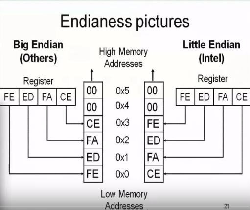

# Road to Binary Exploitation and Reverse Engineering
## Intro to x86 Architecture ([Source](http://opensecuritytraining.info/IntroX86.html))
### Some Basic concepts
* <b>Endianness-</b>
    - Little Endian-The memory (or registers) stores data in a format where the least signiificant byte(8 bits) of a word(32 bits) is stored at the lowest memory address. For example, while storing 0x12345678 into memory, it gets stored as 0x78563412.
    -  Big Endian-The memory stores data in a format where the least signiificant byte(8 bits) of a word(32 bits) is stored at the highest memory address. Considering the same example, while storing 0x12345678 into memory, it gets stored as 0x12345678.  
    
  
* <b>Some general Registers-</b>
    - EAX - Stores return values.
    - EBX - (discussed later on)
    - ECX - Stores value for loop operations (if its value reaches 0 then it means that the loop has terminated)
    - EDX - (discussed later on)
    - ESI - Source pointer for string operations. 
    - EDI - Destination pointer for string operations. 
      For example, copying a string from one location to another uses ESI and EDI pointers.
    - ESP - Stack pointer, as mentioned later it always points to the lowest address which is being used. 
    - EBP - Stores base address for a particular segment or function 
    - EIP - Pointer to next instruction to execute (Instruction pointer).
    - EFLAGS - consists of a series of flag pointers which are responsible for all conditional statements, and some other cases also (flags in this register is updated after every step of execution).  
* <b>Stack</b> : The Stack always grows towards lower memory address.    
* <b>Some Common Instructions-</b>
    - NOP - No operation (:P)
    - PUSH - Pushes a word to the stack (can either be an immediate value or a value in a register). This operation automatically decrements the stack pointer (ESP) by 4 bytes (as on pushing, the stack (and consequently the ESP) advances towards lower memory address and so we need to decrement the stack pointer ) `usage : push <address> (immediate or relative)`.  
    
  
    - POP - Removes a word from the stack and adds 4 to the stack pointer(ESP) `usage : pop <address> (immediate or relative)`.  
    > Some function calling conventions
    > * **Cdecl (C declaration)**
    >     - function parameters are pushed into stack from right to left.
    >     - saves the old stack frame pointer and sets up a new stack frame (as the function has changed).
    >     - **caller** is responsible for cleaning up the stack.
    > * **Stdcall**
    >     - All conventions are same as that of cdecl but the only difference is that instead of the caller the **callee** is responsible for cleaning the stack pointer.
      
    - CALL -
        - It pushes the address of next instruction to the stack (so that RET can use this address when the procedure is done) and then moves to the desired address (EIP is assigned as the new address value).
        - Destination address may be absolute or relative (to the end of the instruction).
    - RET -
        - Using the cdecl convention-
            - Stack is popped into the value of EIP register.
            - The caller then cleans up the stack by popping (and thus incrementing the ESP) the stack values.
        - Using the stdcall convention-
            - Stack is popped into the value of EIP register.
            - The callee is responsible for cleaning up the stack, so the return statements are like ret 0x08, ret 0x20 etc, and are responsible for cleaning up the stack before reaching the retirn address.
    - MOV - Responnsible for moving values from register to register, register to memory, memory to register but **never** from memory to memory `usage : mov <destination>,<source>`.    
             mov eax,ebx    //eax reg will be assigned the value taken by ebx reg
             mov eax,[ebx]  //eax reg will be assigned the value taken by block which is located at the address stored by ebx.  
### Sample Assembly code     
             0000000000400776 <main>:
             400776:   55                 push   %rbp
             400777:   48 89 e5           mov    %rsp,%rbp
             40077a:   be 74 08 40 00     mov    $0x400874,%esi
             40077f:   bf 60 10 60 00     mov    $0x601060,%edi
             400784:   e8 d7 fe ff ff     callq  400660 <_ZStlsISt11char_traitsIcEERSt13basic_ostreamIcT_ES5_PKc@plt>
             400789:   b8 00 00 00 00     mov    $0x0,%eax
             40078e:   5d                 pop    %rbp
             40078f:   c3                 retq     

            