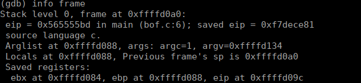

## Learning to use GDB
### What is gdb?
GDB (GNU Debugger), as the name suggests is a command line tool which is used to debug native binary files with formats like [ELF](http://resources.infosecinstitute.com/elf-file-format/) (Executable and Linkable Format), and supports languages like C, C++, Go, etc. Have a look [here](https://sourceware.org/gdb/current/onlinedocs/gdb/Supported-Languages.html#Supported-Languages) to know more about the supported languages.

The following C file is used:
**SimpleDemo.c**
```c
#include<stdio.h>
#include<stdlib.h>

int add(int x, int y)
{
        int z =10;
        z = x + y;
        return z;
}

main(int argc, char **argv)
{
        int a = atoi(argv[1]);
        int b = atoi(argv[2]);
        int c;
        char buffer[2];
        gets(buffer);
        puts(buffer);
        c = add(a,b);
        printf("Sum of %d+%d = %d\n",a, b, c);
        exit(0);
}
``` 
### Some common commands
- `gdb ./<executable>` - It is used to start the debugger for the executable used. For this example, the executable can be easily generated and tested by running the following set of commands:
    ```
    gcc -ggdb -o SimpleDemo SimpleDemo.c
    gdb ./SimpleDemo
    ```
    > Read more about compiling a program using **gcc** [here](https://stackoverflow.com/questions/3178342/compiling-a-c-program-with-gcc) or read its man pages.
- Once the debugger has started, `list <line no.>` will list the source code starting from the line no. provided.
- `run <argv_1> <argv_2>` - Used to run the program with arguments as **argv_1** and **argv_2**.
- `disassemble <function_name>` - Used to see the assembly level code of the **function_name** specified.
- `break <line_no>` - Used to set a breakpoint at the specified line in the source code. Use `help break` for more help on setting breakpoints.
- `next/step` - used to execute instructions one by one.
    - `next` - On a line of code that has a function call, `next` will go 'over' the function call to the next line of code.
    - `step` - On a line of code that has a function call, `step` will go 'into' the function call.
- `info registers` - Shows the values of various registers (gpr and segment) and flags. We can even use the shortcut for this command like `i r eip` to know about the value stored by the **eip** register.
- `set x = 3` - Used to set the value of a local variable to a certain value.
- `finish` - Used to finish a function.
- `print <var_name>` - Used to print the value of a local variable.
- `info frame` - Used to know the info of the current frame on the stack (info about return address and current eip). A typical frame looks like this:
<br>
<center></center>

- `x/FMT ADDRESS` - Examine memory at any moment in the program.
    - Here, **FMT** represents the format in which you desire to see the results. Format is a repeat count followed by the format letter (octal, decimal, etc) and a size letter (word, byte, etc). Available format letters and size letters can be seen from its help by running `help x`. Some common formats are as follows:
        - o - Display in octal
        - x - Display in hexadecimal.
        - u - Display in unsigned, standard base-10 decimal.
        - t - Display in binary. 
    - **ADDRESS** is the address from where we wish to start viewing memory.
    - A number can also be prepended to the format of the examine command to examine multiple units at the target address. For eg: `x/12x $eip` will examine 12 memory addresses starting from the address of **eip** and display the results in hex.
    - The default size of a single unit is a four-byte unit called a *word*. The size of the display units for the examine command can be changed by adding a size letter to the end of the format letter. The valid size letters are as follows:
        - b - A single byte
        - h - A halfword, which is two bytes in size
        - w - A word, which is four bytes in size
        - g - A giant, which is eight bytes in size
    - The examine command also accepts the format letter `i`, short for *instruction*, to display the memory as disassembled assembly language instructions. For eg: `x/3i $eip` will display the next three instructions starting from the **eip** register in disassembled format.
        Some examples of examine command:
        - `x/4xb` will read `0x00fc45c7` in the form of 1 byte at a time and will read 4 such bytes and thus will produce the output as `0xc7 0x45 0xfc 0x00` for a little endian system.
        - `x/4xb $ebp - 4` will examine the memory address which is located at 4 bytes before the **ebp** register.
