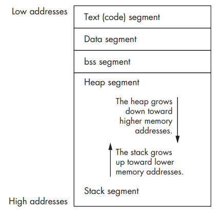

## Assembly Code Structure
The assembly code is divided into various segments which are as follows: 
- `.data` - representation of that segment which holds all the uninitialised data. This segment has fixed size.
- `.bss` - (block started by symbol) that segment which holds all the unallocated variables. This segment also has a fixed size unlike the heap segment which is dynamically allocated.
- `.text` - holds all the program instructions .
    - `_start` - place/label where the assembly program actually starts.
    - `.global _start` - externally callable function so that other parts of the code can use it.

Here is how the memory actually looks like:
<br>
<center></center>

### Linux system calls
- These are the libraries that linux exposes to get various tasks done. Examples are `exit()`, `read()`, etc.
- A list of all system calls available can be viewed in `/usr/include/asm/unistd.h`.
- System calls are invoked by processes by using a software interrupt - `INT 0x80`.

### Arguments for a syscall
The `eax` register holds the *system call number*, whereas others such as `ebx`, `ecx`, etc hold the arguments to be passed.
For example, for `exit(0)` syscall which has the declaration as `void _exit(int status)`, the `ebx` reg will hold the value for the argument status ie 0.<br>
> **TRIVIA** - All system call numbers can be seen within the `/usr/include/asm-generic/unistd.h` file.

An example of the assembly code segment for `exit(0)` syscall:
```assembly
.text
    .globl _start 
    _start:
            mov $1,%eax        //syscall number is 1
            mov $0,%ebx        //argument is 0
            int $0x80            //call 
```
> **TRIVIA** - A simple way to generate an executable for the assembly code is to run `as -o <file_name>.o <file_name>.s | ld -o <file_name> <file_name>.o`. The first command will generate an object file (relocatable format), and the command after piping links the object file to executable format.

### General Info
- Heap is that section of memory where dynamic data is stored. In order to use any section of heap, one needs to first allocate memory by using `malloc()` function in C, which accepts a single integer ie the size to be allocated and returns a void pointer pointing to the start of the allocated block.
- The `malloc()` function returns a void pointer, which needs to be typecast into a pointer whose type is that of the variable which needs to be stored.
- The corresponding deallocation function is `free()` which accepts a pointer as its only argument and frees that memory space on the heap so it can be used again later.
- `malloc()` may sometimes fail in allocating space in memory, in that case it returns a NULL value. In order to be on the safe side, an error checked `malloc()` is usually preferred. The following is an error checked malloc implementation:
```C
void *errorchecked_malloc(unsigned int size) { // An error-checked malloc() function
 void *ptr;
 ptr = malloc(size);
 if(ptr == NULL) {
 fprintf(stderr, "Error: could not allocate heap memory.\n");
 exit(-1);
 }
 return ptr;
}
```