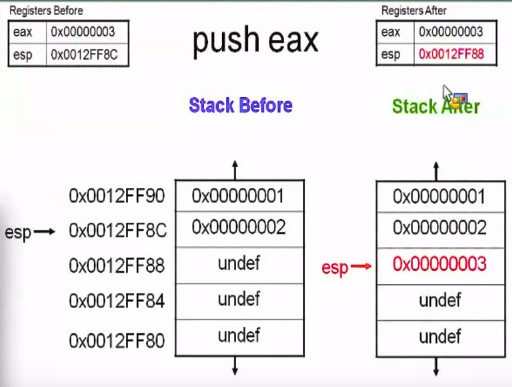

# Road to Binary Exploitation and Reverse Engineering
## Intro to x86 Architecture ([Source](http://opensecuritytraining.info/IntroX86.html))
### Some Basic concepts
* <b>Endianness-</b>
    - Little Endian-The memory (or registers) stores data in a format where the least signiificant byte(8 bits) of a word(32 bits) is stored at the lowest memory address. For example, while storing 0x12345678 into memory, it gets stored as 0x78563412.
    -  Big Endian-The memory stores data in a format where the least signiificant byte(8 bits) of a word(32 bits) is stored at the highest memory address. Considering the same example, while storing 0x12345678 into memory, it gets stored as 0x12345678.<br><br>
            <center></center><br><br>
* <b>Some general Registers-</b>
    - EAX - Stores return values.
    - EBX - (discussed later on)
    - ECX - Stores value for loop operations (if its value reaches 0 then it means that the loop has terminated)
    - EDX - (discussed later on)
    - ESI - Source pointer for string operations. 
    - EDI - Destination pointer for string operations. 
      For example, copying a string from one location to another uses ESI and EDI pointers.
    - ESP - Stack pointer, as mentioned later it always points to the lowest address which is being used. 
    - EBP - Stores base address for a particular segment or function 
    - EIP - Pointer to next instruction to execute (Instruction pointer).
    - EFLAGS - consists of a series of flag pointers which are responsible for all conditional statements, and some other cases also (flags in this register is updated after every step of execution).<br><br>
    
    > **TRIVIA**: The registers `EAX`, `EBX`, `ECX`, `EDX` allow selective access to their lower order bits. The following image explains clearly:<br>
            <center></center><br> 
    > The registers `AX`, `AH` and `AL`give the information about respective bit positions.

* <b>Stack</b> : The Stack always grows towards lower memory address.<br><br>  
* <b>Some Common Instructions-</b>
    - NOP - No operation (:P)
    - PUSH - Pushes a word to the stack (can either be an immediate value or a value in a register). This operation automatically decrements the stack pointer (ESP) by 4 bytes (as on pushing, the stack (and consequently the ESP) advances towards lower memory address and so we need to decrement the stack pointer ) `usage : push <address> (immediate or relative)`.<br><br>
            <center></center><br><br>
    - POP - Removes a word from the stack and adds 4 to the stack pointer(ESP) `usage : pop <address> (immediate or relative)`.<br><br>
    > Some function calling conventions
    > * **Cdecl (C declaration)**
    >     - function parameters are pushed into stack from right to left.
    >     - saves the old stack frame pointer and sets up a new stack frame (as the function has changed).
    >     - **caller** is responsible for cleaning up the stack.
    > * **Stdcall**
    >     - All conventions are same as that of cdecl but the only difference is that instead of the caller the **callee** is responsible for cleaning the stack pointer.
    <br>
    
    - CALL -
        - It pushes the address of next instruction to the stack (so that RET can use this address when the procedure is done) and then moves to the desired address (EIP is assigned as the new address value).
        - Destination address may be absolute or relative (to the end of the instruction).
    - RET -
        - Using the **cdecl** convention-
            - Stack is popped into the value of EIP register.
            - The caller then cleans up the stack by popping (and thus incrementing the ESP) the stack values.
        - Using the **stdcall** convention-
            - Stack is popped into the value of EIP register.
            - The callee is responsible for cleaning up the stack, so the return statements are like ret 0x08, ret 0x20 etc, and are responsible for cleaning up the stack before reaching the return address.
    - MOV - Responsible for moving values from register to register, register to memory, memory to register but **never** from memory to memory `usage : mov <destination>,<source>`.<br>

    ```
        INTEL SYNTAX : Commands go by the format Destination <- Source(s).
                 mov eax,ebx    //eax reg will be assigned the value taken by ebx reg
                 mov eax,[ebx]  //eax reg will be assigned the value taken by block which is located at the address stored by ebx.
        
        AT&T SYNTAX : Commands go by the format Source(s) <- Destination and use % sign before register names. 
                mov %ebx,%eax    
                mov ebx,[eax]
    ```
    **Sample Assembly Code**
    ```
                 0000000000400776 <main>:
                 400776:   55                 push   %rbp
                 400777:   48 89 e5           mov    %rsp,%rbp
                 40077a:   be 74 08 40 00     mov    $0x400874,%esi
                 40077f:   bf 60 10 60 00     mov    $0x601060,%edi
                 400784:   e8 d7 fe ff ff     callq  400660
                 400789:   b8 00 00 00 00     mov    $0x0,%eax
                 40078e:   5d                 pop    %rbp
                 40078f:   c3                 retq      
    ```
    - LEA (Load effective address) - Contrary to `mov` which goes to the memory location to get the value stored there and stores it into  the register, `lea` is merely used for address caluculation stuff and does not go to the memory. So, when we write `lea eax,[ebx]`, then we are assigning `eax` with the value that is equal to the value taken by `ebx` and not the one taken by the value at the   address `ebx`. 
    - JMP (Jump) - This instruction is used to jump to the provided address. You might say that it is similar to the `CALL`instruction,  but it is different in a sense that in the jump instruction does not return back to the address from where it isbeing called,    whereas call instruction is guaranteed to return to the address from which it is being called. **Usage**:  `jmp <immediate_address>`. 
    - jne (jump if not equal) - With `jne`, the control will jump to  thespecified address if the comparison above it shows that the 2 numbers are not equal. The use of some other similar operations like `je`(jump if equal), `jl`(jump if less than), `jle`(jump if less than or equal to), `jg`(jump if greater than), `jge`(jump if greater than or equal to) can also be understood intuitively.<br> 
    **Usage**:
    ```
             cmp eax,ecx
             jne 0040103020
    ```         
    The above statement will jump to address 0040103020 if the comparison above evaluates to **false**.
    - movsb/movsw/movsd - These set of commands are used to move a 1 byte(b)/2 byte(w)/4 byte(d) value respectively from the `edi` register to the `esi` register.Typically, this command automatically increments both these registers by 4 bytes after execution.
    - rep movsd - This is an advanced form of the previous command. This repeats the `movsd` command 8 times, ie it copies a 32 bit value instead of a regular 4 byte value.

* <b>Calling Functions-</b>
    We can write functions in assembly and call them either from assembly code itself or from a C code.
    Here are both the two methods.
    - Calling from assembly itself:<br><br>
    ```
            global _start
            _start:
                push 21  //value to be passed to the function needs to be pushed into the stack
                call times2
                mov ebx, eax //storing exit code in ebx register, the eax reg stores the returned value.
                mov eax, 1   //store 1 in eax to perform sys_exit system call
                int 0x80  //interrupt to perform syscall for exit
            times2:
                push ebp //push ebp to keep track of address to return to whereas the stack can still grow
                mov ebp, esp
                mov eax, [ebp+8] //accessing the returned value and storing it in eax
                add eax, eax 
                mov esp, ebp //moving esp back to ebp
                pop ebp //restore the stack back to the state before this function was called
                ret //keyword to return to the callee
    ```
    EXPLAINATION : Whenever a `call` is encountered, the address of the next statement (here the `mov ebx, eax` line) is pushed to the stack and after we reach *times2* function, we have pushed an additional register ebp into the stack (Remember that the function argument (here 21) is present before the    return address in the stack). So, in order to access arguments passed we need to access value at `ebp  +8` at the least, and then advance by 4 for each argument. For example, in case, there are three  arguments, then they can be accessed by `ebp+8`, `ebp+12` and `ebp+16`. (`ebp+4` returns the returned  address stored in the stack). This pushing of `ebp` at the start and popping it at the end of a    function ensures the proper functioning of stack in case of nested function calls as each function     manages its section of stack after the `ebp` pointer, and safely pops it before returning.<br>
    
    - Calling from C code :<br>
    In this case we'll just declare the function in the assembly code and call it from the C code.<br><br>
    ```
            global add42
            add42:
                push ebp
                mov ebp, esp
                mov eax, [ebp+8]
                add eax, 42
                mov esp, ebp
                pop ebp
                ret
    ```
    
    In order to access the above function we'll just create a C header file so that our C code can access the function.
    
    ```C
    //add42.h
    int add42(int x)
    ```
    
    and the main function: 
    
    ```C
    //main.c
    #include <stdio.h>
    #include "add42.h"
        
    int main(){
    int answer;
    answer = add42(30);
    printf("Result: %i\n", answer);        
    return 0;
    }
    ```
    
    *Running the above code:*<br>
    - The assembly code can be converted into an object file (.o extension) using an assembler. One such  assembler is **nasm**. We can use the following command to convert assembly code to an object file : `nasm -f elf32 add42.asm -o add42.o`. `elf32` is the executable and linkable format for a 32-bit linux system.
    - Then in order to link it, we can use `gcc` to link the object code to our C library. This can be done as `gcc -m32 add42.o main.c ex` (`ex` is the name to our executable file).
    - We can use a common C code but the assembly code is platform-dependent.